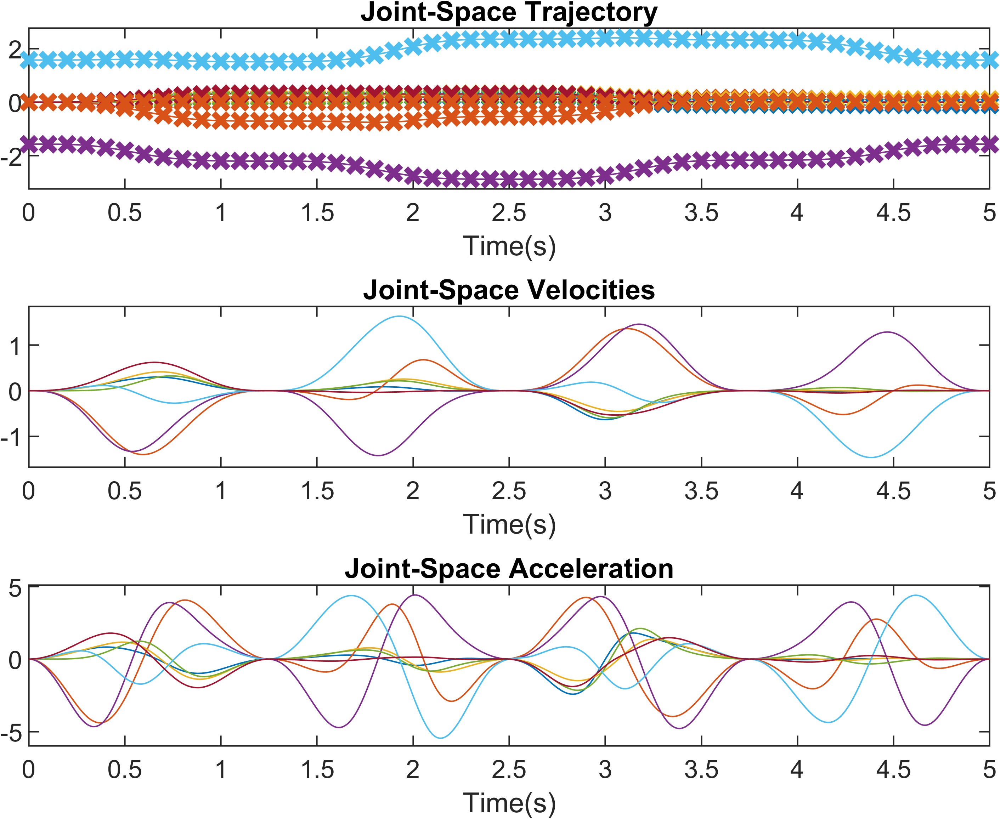
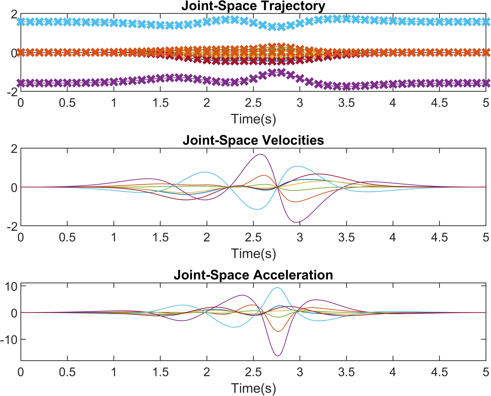
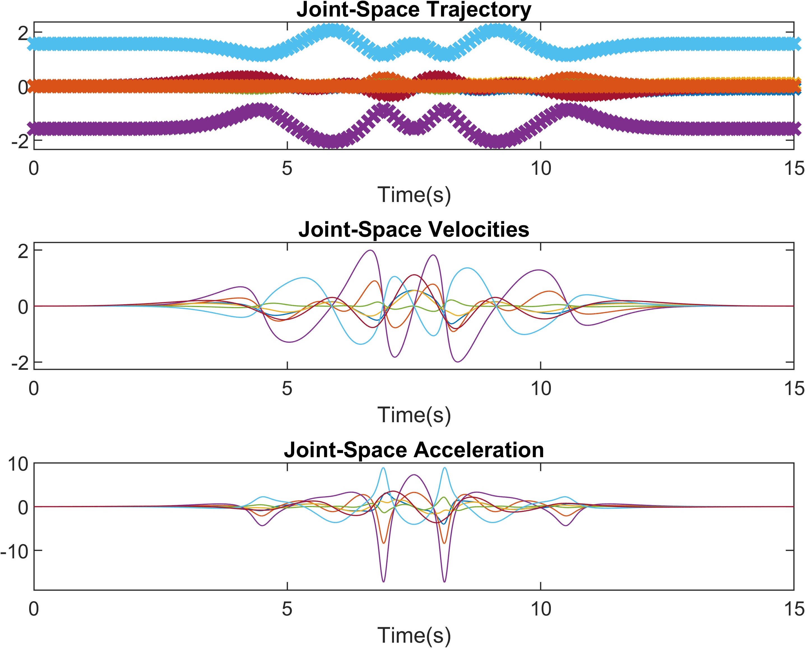
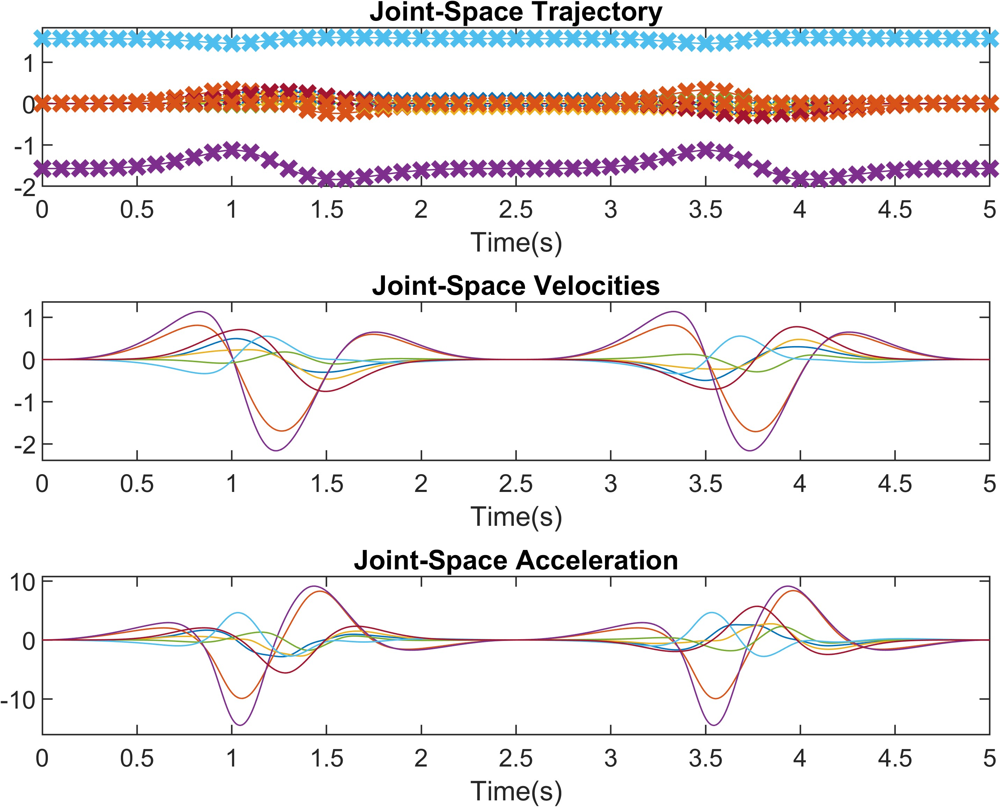
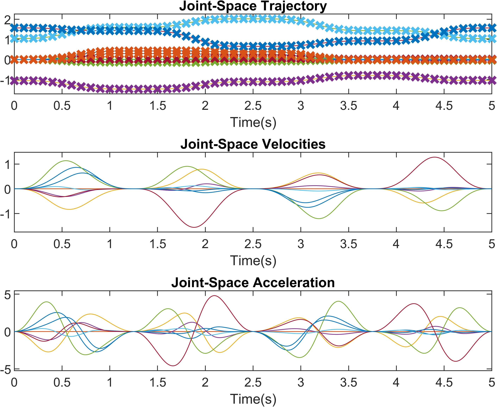
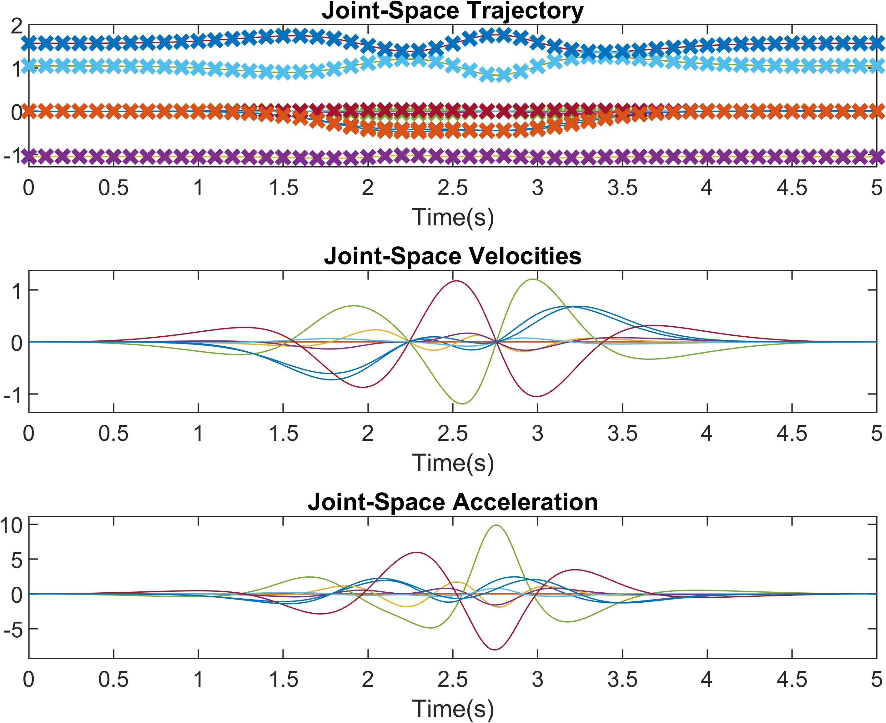
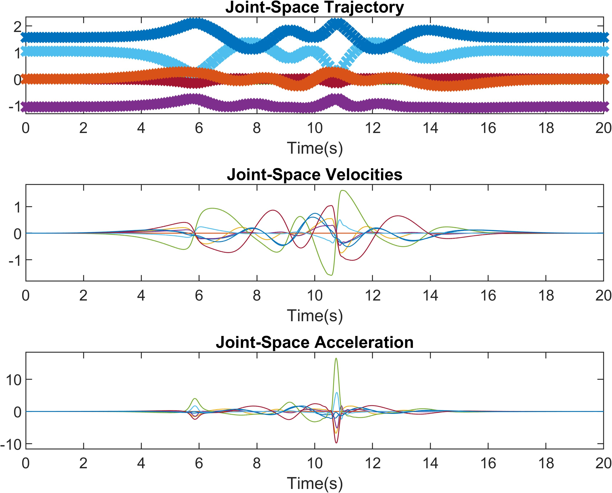
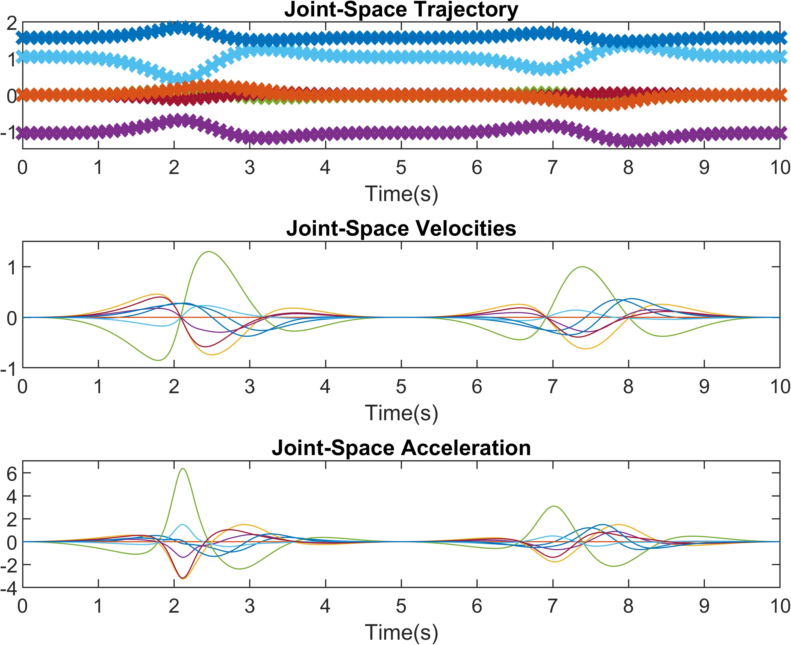

# Trajectory-planning-for-robot-manipulators-


# Trajectory planning of Panda robot

* Author: Yuejiang Zhu from RCLLab, CSE@SYSU
* Date: 2023/10/29
* email: zhuyj69@mail2.sysu.edu.cn

## Description

This project achieves trajectory planning of robot manipulators supported by Robotics System Toolbox in the Matlab environment.  The planned trajectories including positions, velocities, and accelerations in cartesian space have been well-tested to verify their derivative relationships in UnitTest_CartesianTraj.m  . The generated cartesian trajectories are sampled in specified time periods to play as waypoints. Applying inverse kinematics to these waypoints by using the ik function yields the waypoints in joint space. Then interpolating these waypoints in joint space generates the dense final joint trajectories.  The operations of inverse kinematics and interpolation are enclosed in a single function "getJointTraj.m". 

## Characteristics

* support for any robot manipulators in the Robotics System Toolbox

  (the newly designed robot can be also supported by using the [importrobot](https://ww2.mathworks.cn/help/robotics/ref/importrobot.html?searchHighlight=importrobot&s_tid=srchtitle_support_results_1_importrobot) function if the URDF file is available )   

* smooth treatment of trajectories ( the polar angle of the parametric function of a specified shape as a sin-related function that varies from 0 to 2pi in a time interval and keeps smooth). 

* multiple choices of cartesian trajectories including fish shape, square shape, infinity-like shape, and rose shape

* multiple choices of trajectories determined by [interpolation](https://ww2.mathworks.cn/help/robotics/ug/choose-trajectories-for-manipulator-paths.html) ways including minimum-jerk, trapezoidal velocity,  cubic and quintic polynomial, and B-spline trajectories.

## Run 

* install the Robotics System Toolbox in Matlab
* add the outermost layer of the folder and its subfolders to the path

* run the UnitTest_CartesianTraj.m to get familiar with and verify the cartesian trajectories
* run UnitTest_JointTraj.m to get familiar with and verify the joint trajectories
* run main.m to generate the joint trajectories and cartesian trajectories at the same time and to see the visualizations.

 ## Examples

Sometimes the planned trajectories reach beyond the joint limits of the robot manipulators, which makes them not available. The availability of planned trajectories is determined by many aspects including the home configuration of the robot (q0_s), the magnitudes of the shape (radius, n, alpha), the way of the interpolation (interpolation_type), and the choices of sampling rates (Ts_s, Ts_p), the time interval (t_begin, t_end). Here are some examples of parameter setups in main.m and figures of several available planned trajectories.  

### Franka Emika Panda

#### square 

```matlab	
robot_type = 1;
shape_type = 1; % square:1, fish:2, rose:3, infinitylike:4
degree = -30;
alpha = degree/180*pi; % angle between square face and XZ plane in square shape
radius = 0.3; % amplitude for 4 shapes
n = 3; % number of petals for rose shape
interploration_type = 1; % Minimum-Jerk Trajectory:1, Trapezoidal Velocity Profile Trajectory:2,  Cubic and Quintic Polynomial Trajectories:3, B-Spline Trajectory:4
t_begin = 0; % start time of trajectory (s)
T = 5; % period of the trajectory (s)
t_end = t_begin + T; % end time of trjectory (s)
Ts_s = 0.1; % sampling period of waypoints to be used for inverse kinematics and interploration (s)
Ts_p = 0.001; % period of final trajectories (s)
Ts_ani = 0.02; % sampling period of the visulization

q0_panda = [0 0 0 -pi/2 0 pi/2 0 0 0]';
```




#### fish

```matlab
robot_type = 1;
shape_type = 2; % square:1, fish:2, rose:3, infinitylike:4
degree = -30;
alpha = degree/180*pi; % angle between square face and XZ plane in square shape
radius = 0.12; % amplitude for 4 shapes
n = 3; % petals for rose shape
interpolation_type = 1; % Minimum-Jerk Trajectory:1, Trapezoidal Velocity Profile Trajectory:2,  Cubic and Quintic Polynomial Trajectories:3, B-Spline Trajectory:4
t_begin = 0; % start time of trajectory (s)
T = 5; % period of the trajectory (s)
t_end = t_begin + T; % end time of trjectory (s)
Ts_s = 0.1; % sampling period of waypoints to be used for inverse kinematics and interploration (s)
Ts_p = 0.001; % period of final trajectories (s)
Ts_ani = 0.02; % sampling period of the visulization

q0_panda = [0 0 0 -pi/2 0 pi/2 0 0 0]';
```




#### rose

```matlab
robot_type = 1;
shape_type = 3; % square:1, fish:2, rose:3, infinitylike:4
degree = -30;
alpha = degree/180*pi; % angle between square face and XZ plane in square shape
radius = 0.2; % amplitude for 4 shapes
n = 3; % petals for rose shape
interploration_type = 1; % Minimum-Jerk Trajectory:1, Trapezoidal Velocity Profile Trajectory:2,  Cubic and Quintic Polynomial Trajectories:3, B-Spline Trajectory:4
t_begin = 0; % start time of trajectory (s)
T = 10; % period of the trajectory (s)
t_end = t_begin + T; % end time of trjectory (s)
Ts_s = 0.1; % sampling period of waypoints to be used for inverse kinematics and interploration (s)
Ts_p = 0.001; % period of final trajectories (s)
Ts_ani = 0.02; % sampling period of the visulization

q0_panda = [0 0 0 -pi/2 0 pi/2 0 0 0]';
```




### infinity

``` matlab
robot_type = 1;
shape_type = 4; % square:1, fish:2, rose:3, infinitylike:4
degree = -30;
alpha = degree/180*pi; % angle between square face and XZ plane in square shape
radius = 0.08; % amplitude for 4 shapes
n = 3; % petals for rose shape
interploration_type = 1; % Minimum-Jerk Trajectory:1, Trapezoidal Velocity Profile Trajectory:2,  Cubic and Quintic Polynomial Trajectories:3, B-Spline Trajectory:4
t_begin = 0; % start time of trajectory (s)
T = 5; % period of the trajectory (s)
t_end = t_begin + T; % end time of trjectory (s)
Ts_s = 0.1; % sampling period of waypoints to be used for inverse kinematics and interploration (s)
Ts_p = 0.001; % period of final trajectories (s)
Ts_ani = 0.02; % sampling period of the visulization

q0_panda = [0 0 0 -pi/2 0 pi/2 0 0 0]';
```




### rethinkSawyer

#### square

```matlab
robot_type = 2;
shape_type = 1; % square:1, fish:2, rose:3, infinitylike:4
degree = -30;
alpha = degree/180*pi; % angle between square face and XZ plane in square shape
radius = 0.3; % amplitude for 4 shapes
n = 3; % petals for rose shape
interploration_type = 1; % Minimum-Jerk Trajectory:1, Trapezoidal Velocity Profile Trajectory:2,  Cubic and Quintic Polynomial Trajectories:3, B-Spline Trajectory:4
t_begin = 0; % start time of trajectory (s)
T = 5; % period of the trajectory (s)
t_end = t_begin + T; % end time of trjectory (s)
Ts_s = 0.1; % sampling period of waypoints to be used for inverse kinematics and interploration (s)
Ts_p = 0.001; % period of final trajectories (s)
Ts_ani = 0.02; % sampling period of the visulization

q0_sawyer = [0 0 -pi/3 0 pi/3 0 pi/2 0]';
```




#### fish

```matlab
robot_type = 2;
shape_type = 2; % square:1, fish:2, rose:3, infinitylike:4
degree = -30;
alpha = degree/180*pi; % angle between square face and XZ plane in square shape
radius = 0.15; % amplitude for 4 shapes
n = 3; % petals for rose shape
interploration_type = 1; % Minimum-Jerk Trajectory:1, Trapezoidal Velocity Profile Trajectory:2,  Cubic and Quintic Polynomial Trajectories:3, B-Spline Trajectory:4
t_begin = 0; % start time of trajectory (s)
T = 5; % period of the trajectory (s)
t_end = t_begin + T; % end time of trjectory (s)
Ts_s = 0.1; % sampling period of waypoints to be used for inverse kinematics and interploration (s)
Ts_p = 0.001; % period of final trajectories (s)
Ts_ani = 0.02; % sampling period of the visulization

q0_sawyer = [0 0 -pi/3 0 pi/3 0 pi/2 0]';
```




#### rose

```matlab
robot_type = 2;
shape_type = 3; % square:1, fish:2, rose:3, infinitylike:4
degree = -30;
alpha = degree/180*pi; % angle between square face and XZ plane in square shape
radius = 0.2; % amplitude for 4 shapes
n = 3; % petals for rose shape
interploration_type = 1; % Minimum-Jerk Trajectory:1, Trapezoidal Velocity Profile Trajectory:2,  Cubic and Quintic Polynomial Trajectories:3, B-Spline Trajectory:4
t_begin = 0; % start time of trajectory (s)
T = 20; % period of the trajectory (s)
t_end = t_begin + T; % end time of trjectory (s)
Ts_s = 0.1; % sampling period of waypoints to be used for inverse kinematics and interploration (s)
Ts_p = 0.001; % period of final trajectories (s)
Ts_ani = 0.02; % sampling period of the visulization

q0_sawyer = [0 0 -pi/3 0 pi/3 0 pi/2 0]';
```




#### infinity

```matlab
robot_type = 2;
shape_type = 4; % square:1, fish:2, rose:3, infinitylike:4
degree = -30;
alpha = degree/180*pi; % angle between square face and XZ plane in square shape
radius = 0.08; % amplitude for 4 shapes
n = 3; % petals for rose shape
interploration_type = 1; % Minimum-Jerk Trajectory:1, Trapezoidal Velocity Profile Trajectory:2,  Cubic and Quintic Polynomial Trajectories:3, B-Spline Trajectory:4
t_begin = 0; % start time of trajectory (s)
T = 10; % period of the trajectory (s)
t_end = t_begin + T; % end time of trjectory (s)
Ts_s = 0.1; % sampling period of waypoints to be used for inverse kinematics and interploration (s)
Ts_p = 0.001; % period of final trajectories (s)
Ts_ani = 0.02; % sampling period of the visulization

q0_sawyer = [0 0 -pi/3 0 pi/3 0 pi/2 0]';
```




